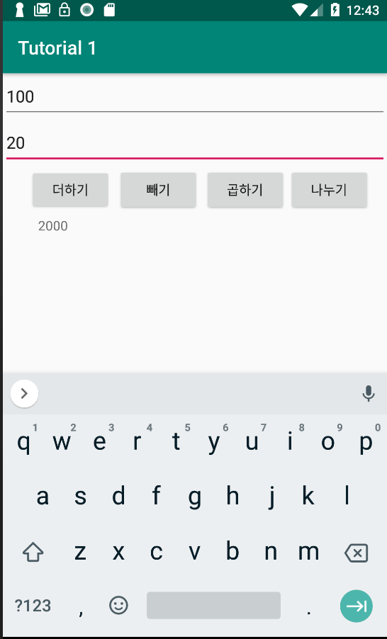
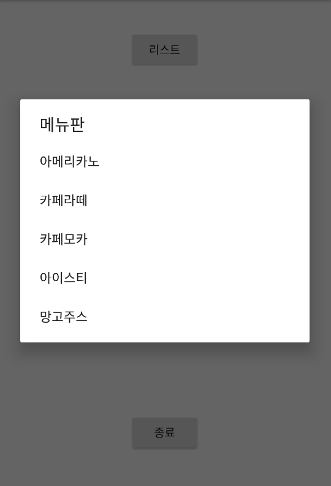
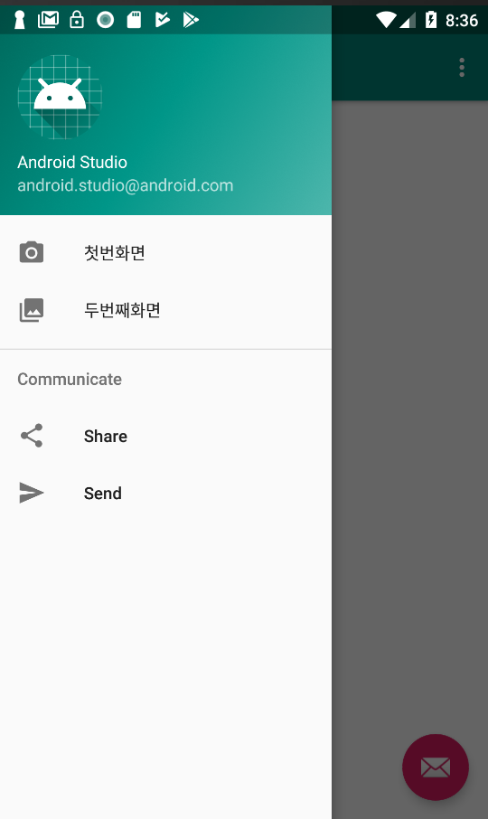
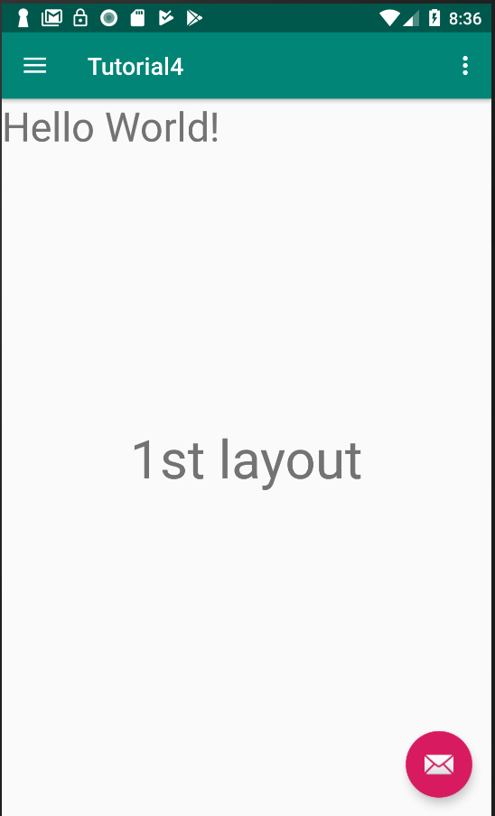
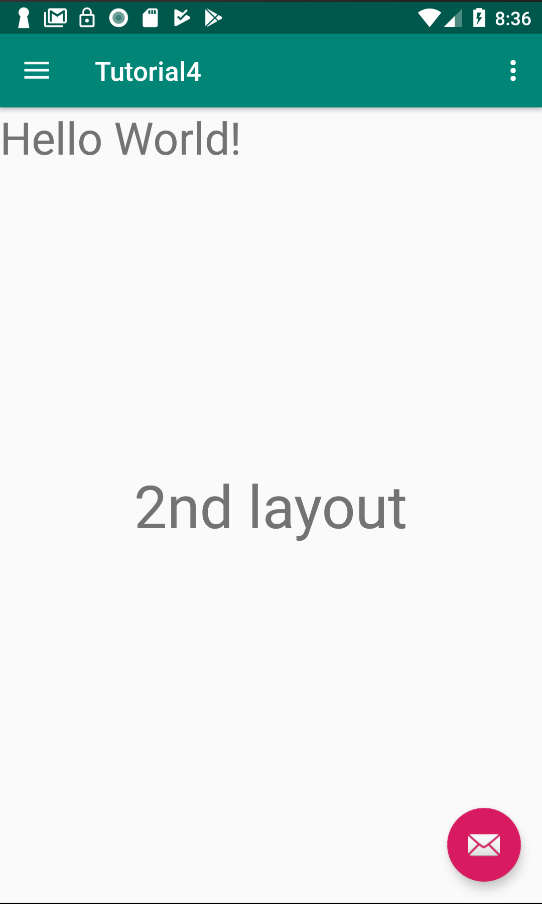

# android_example_for_Study
android

## Screen Shot

### 사칙연산

<pre><code>    public void addClick(View v) {
        EditText number1 = (EditText) findViewById(R.id.number1); // deal number2 same
        TextView result = (TextView) findViewById(R.id.result);
        int num1 = Integer.parseInt(number1.getText().toString()); // deal number2 same
        result.setText(Integer.toString(num1 + num2));
    }
</code></pre>

### 알림창

<pre><code>   
        listBtn.setOnClickListener(new View.OnClickListener() {
            @Override
            public void onClick(View v) {
                AlertDialog.Builder builder = new AlertDialog.Builder(MainActivity.this);
                builder.setTitle("메뉴판");
                builder.setItems(items, new DialogInterface.OnClickListener() {
                    @Override
                    public void onClick(DialogInterface dialog, int i) {
                        Toast.makeText(getApplicationContext(), items[i], Toast.LENGTH_SHORT).show();
                    }
                });
                AlertDialog alertDialog = builder.create();
                alertDialog.show();
            }
        });
</code></pre>

### 네비게이션 햄버거 메뉴

<pre><code>   
// MainActivity.java
FragmentManager manager = getFragmentManager();
if (id == R.id.nav_first_layout) {
   manager.beginTransaction().replace(R.id.content_main, new FirstLayout()).commit();
} else if (id == R.id.nav_second_layout) {
   manager.beginTransaction().replace(R.id.content_main, new SecondLayout()).commit();
}
   
// FirstLayout.java
public class FirstLayout extends Fragment {
   View v;
   @Nullable
   @Override
   public View onCreateView(@NonNull LayoutInflater inflater, @Nullable ViewGroup container, @Nullable Bundle savedInstanceState) {
       v = inflater.inflate(R.layout.first_layout, container, false);
       return v;
   }
}

         
